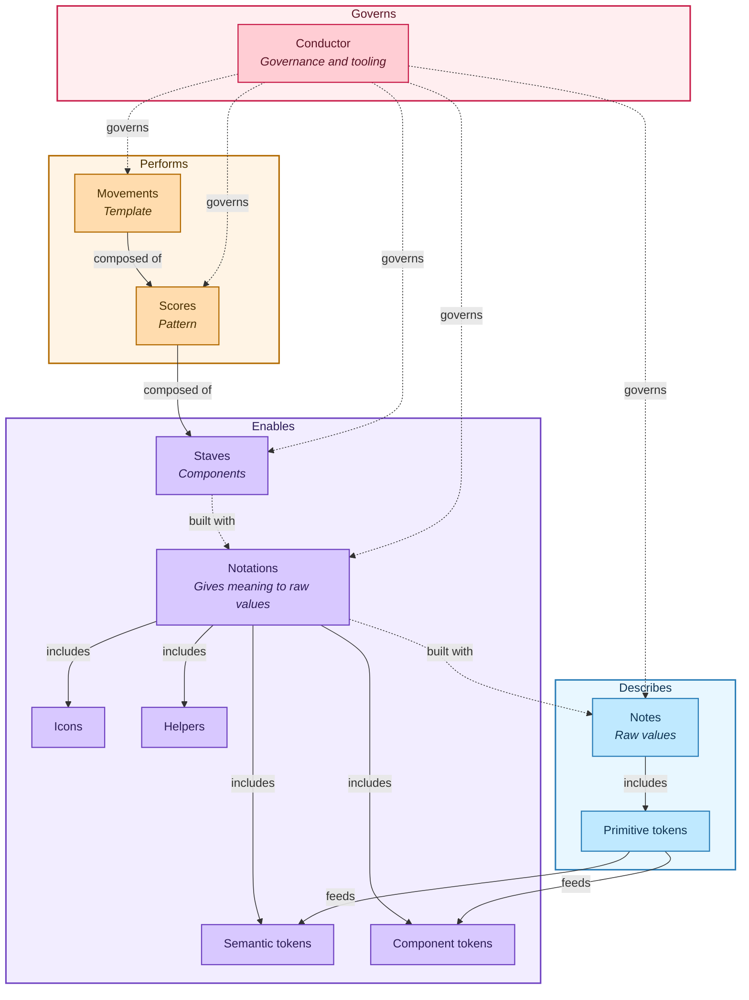

# Orchestra Design System

Orchestra is a monorepo for the Orchestra Design System.
It is built around Stencil web components, token-driven theming, and framework wrappers for Angular, React, and Vue.
The repository is organized with npm workspaces and Lerna, and includes packages for core components, themes, icon assets, and Storybook documentation/testing.

## Philosophy

Orchestra is a design system organized like an orchestra.
The structure and philosophy is organized into four role layers: **Describes**, **Enables**, **Performs**, and **Governs**. Each layer builds on the one below it, moving from raw values up to fully composed, governed patterns, ensuring flexibility and scalability.

## The four role layers

1. **Describes**
   The foundation. Notes are raw values with no meaning attached yet (e.g. a hex code, a number).

2. **Enables**
   Notations take the raw values and give them meaning. It also enables the performence.

3. **Performs**
   This is where the system moves from individual building blocks to real, assembled UI.

4. **Governs**
   Ensuring consistency and providing the tooling that ties the system together.

## The metaphor behind the Design System

| Musical term | Design system role                                      | Role Layer |
| ------------ | ------------------------------------------------------- | ---------- |
| Notes        | Raw values                                              | Describes  |
| Notations    | Meaning applied to raw values (tokens, helpers, assets) | Enables    |
| Staves       | Individual components                                   | Enables    |
| Scores       | Patterns (repeatable part of the UI following rules)    | Performs   |
| Movements    | Templates (full page/flow compositions)                 | Performs   |
| Conductor    | Governance and tooling across the whole system          | Governs    |

## Anatomy



## Decision Rule

When adding something new, the idea is to ask those questions:

- Does it describe a primitive value? -> Note
- Does it enable composition? -> Notation or Stave
- Does it perform an interface? -> Score or Movement
- Does it govern the system? -> Conductor

## Repository Structure

```text
orchestra/
├── packages/
│   ├── themes/            # Notes and Notation tokens
│   ├── core/              # Notations and Staves
│   ├── storybook/         # Scores and Movements (documentation and composed examples)
│   ├── icons-library/     # Notations (Shared visual assets)
│   ├── angular/           # Staves (Framework wrapper)
│   ├── react/             # Staves (Framework wrapper)
│   └── vue/               # Staves (Framework wrapper)
├── .github/workflows/     # Conductor (CI, release, and Storybook deploy workflows)
├── lerna.json             # Conductor (Workspace orchestration)
└── package.json           # Conductor (npm workspaces and root scripts)
```

## Requirements

- Node.js 24 (from `.nvmrc`)
- npm (workspace installs use `npm` + Lerna)

## Quick start

```bash
npm install
npm run build
```

Start development (core watcher + Storybook dev server):

```bash
npm run dev
```

## Root scripts

- `npm run dev`: starts Storybook development and core watchers
- `npm run build`: builds themes first, then all workspaces
- `npm run lint`: runs repository linting
- `npm run test`: runs Storybook/Vitest test project
- `npm run release` / `npm run release:dry`: root release workflow

## Package documentation

- [packages/core/README.md](packages/core/README.md): Stencil components and component package usage
- [packages/themes/README.md](packages/themes/README.md): public theme bundles
- [packages/icons-library/README.md](packages/icons-library/README.md): icon build and exports
- [packages/angular/README.md](packages/angular/README.md): Angular wrapper package
- [packages/react/README.md](packages/react/README.md): React wrapper package
- [packages/vue/README.md](packages/vue/README.md): Vue wrapper package
- [packages/storybook/README.md](packages/storybook/README.md): Storybook setup and stories

## Development workflow

Component implementation guidance lives in the core package README:

- [packages/core/README.md](packages/core/README.md)

## CI and release

- `workflow.yml`: runs lint on pushes/PRs and tests on main
- `storybook-deploy.yml`: deploys Storybook
- `release.yml`: manual (`workflow_dispatch`) release job, gated to main, supports dry-run input

## License

MIT
