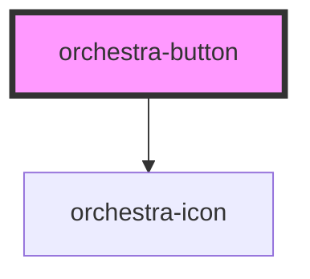

# core-button

<!-- Auto Generated Below -->

## Properties

| Property            | Attribute      | Description                                                                                                                                                                                                                   | Type                                     | Default             |
| ------------------- | -------------- | ----------------------------------------------------------------------------------------------------------------------------------------------------------------------------------------------------------------------------- | ---------------------------------------- | ------------------- |
| `disabled`          | `disabled`     | A boolean indicating the disable state of the button. The `aria-disabled` attribute relies on this property.                                                                                                                  | `boolean`                                | `false`             |
| `icon`              | `icon`         | It allows to render the chosen icon.  The icon render only if `iconName` and `iconPosition` are defined.                                                                                                                      | `"end" \| "none" \| "only" \| "start"`   | `'none'`            |
| `iconLibrary`       | `icon-library` | The name of the icon library used by the button icons.                                                                                                                                                                        | `string`                                 | `'orchestra-icons'` |
| `iconName`          | `icon-name`    | The name of the icon library used by the button icon. Defaults to 'orchestra-icons'. Consumers can override this when they register another icon library.  The icon render only if `iconName` and `iconPosition` are defined. | `string`                                 | `undefined`         |
| `size`              | `size`         | A string indicating the size variation of the button.                                                                                                                                                                         | `"large" \| "medium" \| "small"`         | `'medium'`          |
| `text` _(required)_ | `text`         | This is the text which appear inside the button. It is required.                                                                                                                                                              | `string`                                 | `undefined`         |
| `type`              | `type`         | A string indicating the behavior of the button. It relies on `HTMLButtonElement['type']`                                                                                                                                      | `"button" \| "reset" \| "submit"`        | `'button'`          |
| `variant`           | `variant`      | A string indicating the design variation of the button based on the level of importance.                                                                                                                                      | `"primary" \| "secondary" \| "tertiary"` | `'primary'`         |

## Dependencies

### Depends on

- [orchestra-icon](../icon)

### Graph

----------------------------------------------

