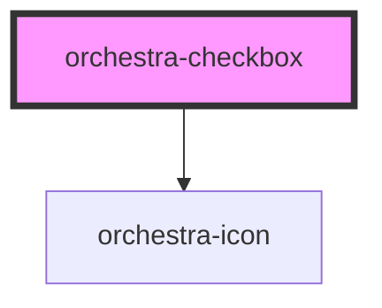

# orchestra-checkbox

<!-- Auto Generated Below -->

## Properties

| Property            | Attribute            | Description                                                                                                                                                              | Type      | Default     |
| ------------------- | -------------------- | ------------------------------------------------------------------------------------------------------------------------------------------------------------------------ | --------- | ----------- |
| `ariaDescribedby`   | `aria-describedby`   | ID reference(s) to element(s) that describe this checkbox.                                                                                                               | `string`  | `undefined` |
| `ariaLabel`         | `aria-label`         | Accessible label for screen readers when no visible label is associated.                                                                                                 | `string`  | `undefined` |
| `ariaLabelledby`    | `aria-labelledby`    | ID reference(s) to element(s) that label this checkbox.                                                                                                                  | `string`  | `undefined` |
| `checked`           | `checked`            | A boolean indicating the checked state of the checkbox.                                                                                                                  | `boolean` | `false`     |
| `disabled`          | `disabled`           | A boolean indicating the disable state of the checkbox.                                                                                                                  | `boolean` | `false`     |
| `htmlId`            | `html-id`            | The unique identifier for the checkbox input. Used to associate with external label elements.                                                                            | `string`  | `undefined` |
| `indeterminate`     | `indeterminate`      | A boolean indicating the indeterminate state of the checkbox (shows a dash/minus sign). This is part of the native HTML checkbox API for mixed/partial selection states. | `boolean` | `false`     |
| `label`             | `label`              | Optional visible label text displayed next to the checkbox.                                                                                                              | `string`  | `undefined` |
| `name`              | `name`               | A string representing the name of the checkbox for form submission.                                                                                                      | `string`  | `''`        |
| `required`          | `required`           | A boolean indicating whether the field is required.                                                                                                                      | `boolean` | `false`     |
| `validationMessage` | `validation-message` | Optional custom validity message. When set to a non-empty string, the field is invalid.                                                                                  | `string`  | `''`        |
| `value`             | `value`              | A string representing the value of the checkbox for form submission.                                                                                                     | `string`  | `'on'`      |

## Events

| Event                  | Description                                                              | Type                                |
| ---------------------- | ------------------------------------------------------------------------ | ----------------------------------- |
| `orchestraChange`      | Native change event - emitted when checkbox state changes.               | `CustomEvent<boolean>`              |
| `orchestraStateChange` | Rich state change payload for consumers that need full checkbox context. | `CustomEvent<CheckboxChangeDetail>` |

## Methods

### `checkValidity() => Promise<boolean>`

Checks whether the checkbox satisfies all constraints.

#### Returns

Type: `Promise<boolean>`

### `reportValidity() => Promise<boolean>`

Reports validity and prompts the browser to show the validation UI.

#### Returns

Type: `Promise<boolean>`

### `setCustomValidity(message: string) => Promise<void>`

Sets a custom validity message. Pass an empty string to clear custom errors.

#### Parameters

| Name      | Type     | Description |
| --------- | -------- | ----------- |
| `message` | `string` |             |

#### Returns

Type: `Promise<void>`

## Dependencies

### Depends on

- [orchestra-icon](../icon)

### Graph

----------------------------------------------

