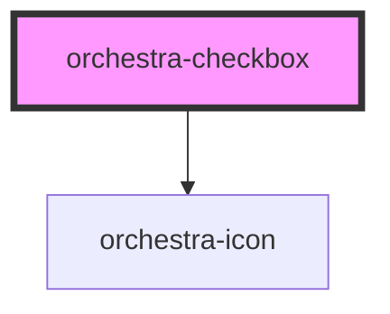

# orchestra-checkbox

<!-- Auto Generated Below -->

## Properties

| Property        | Attribute       | Description                                                                                                                                                              | Type      | Default     |
| --------------- | --------------- | ------------------------------------------------------------------------------------------------------------------------------------------------------------------------ | --------- | ----------- |
| `checked`       | `checked`       | A boolean indicating the checked state of the checkbox.                                                                                                                  | `boolean` | `false`     |
| `disabled`      | `disabled`      | A boolean indicating the disable state of the checkbox.                                                                                                                  | `boolean` | `false`     |
| `htmlId`        | `html-id`       | The unique identifier for the checkbox input. Used to associate with external label elements.                                                                            | `string`  | `undefined` |
| `indeterminate` | `indeterminate` | A boolean indicating the indeterminate state of the checkbox (shows a dash/minus sign). This is part of the native HTML checkbox API for mixed/partial selection states. | `boolean` | `false`     |
| `name`          | `name`          | A string representing the name of the checkbox for form submission.                                                                                                      | `string`  | `''`        |
| `required`      | `required`      | A boolean indicating whether the field is required.                                                                                                                      | `boolean` | `false`     |
| `value`         | `value`         | A string representing the value of the checkbox for form submission.                                                                                                     | `string`  | `'on'`      |

## Events

| Event             | Description                                                | Type                   |
| ----------------- | ---------------------------------------------------------- | ---------------------- |
| `orchestraChange` | Native change event - emitted when checkbox state changes. | `CustomEvent<boolean>` |

## Dependencies

### Depends on

- [orchestra-icon](../icon)

### Graph

----------------------------------------------

