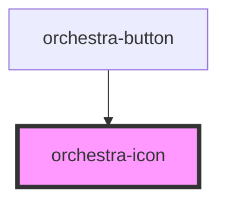

# orchestra-icon

<!-- Auto Generated Below -->

## Properties

| Property            | Attribute | Description                                                                            | Type     | Default          |
| ------------------- | --------- | -------------------------------------------------------------------------------------- | -------- | ---------------- |
| `fill`              | `fill`    | Taking the currentcolor (inherited color of the font) by default, except if specified. | `string` | `'currentcolor'` |
| `library`           | `library` | The name of the icon library to use. Defaults to 'core'.                               | `string` | `'core'`         |
| `name` _(required)_ | `name`    | The name of the icon to display. Resolves using registered icon libraries.             | `string` | `undefined`      |
| `size`              | `size`    | Taking the size of the parent element by default, except if specified.                 | `string` | `'100%'`         |

## Dependencies

### Used by

 - [orchestra-button](../button)

### Graph

----------------------------------------------

